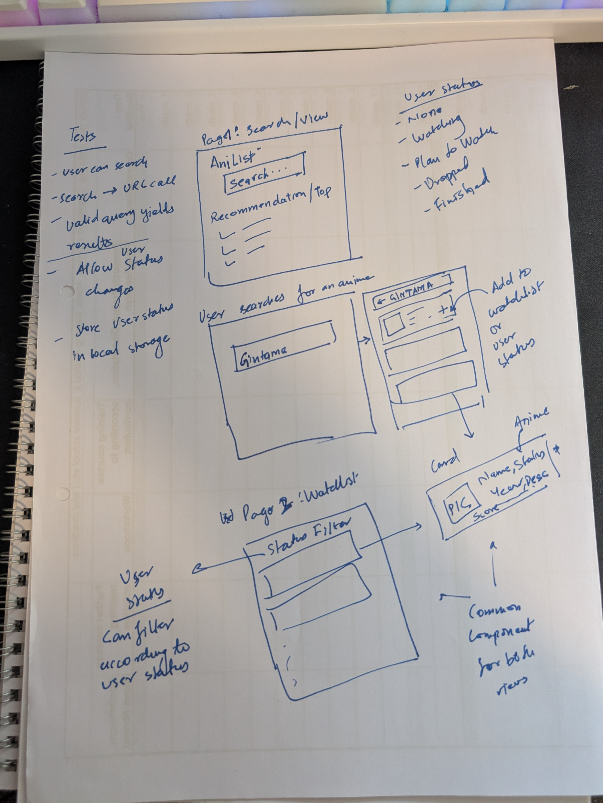

# Otaku Atlas

A modern anime tracking application built with Vue 3, TypeScript, and GraphQL. Track your favorite anime, manage your watchlist, and discover new series with an intuitive interface.

## 🚀 Features

- **Anime Search**: Discover anime with simple search functionality
- **Watchlist Management**: Track anime with status (watching, completed, planning, etc.)
- **Detailed Anime Information**: View comprehensive details, ratings, and metadata
- **Responsive Design**: Beautiful UI that works on desktop and mobile
- **Theme Switching**: Light, dark, and system theme support
- **Real-time Updates**: GraphQL-powered real-time data fetching

## 🏗️ Architecture

### Core Components

- **`NavigationBar.vue`** - Main navigation with Home and Watchlist links
- **`ThemeSwitcher.vue`** - Theme toggle component (light/dark/system)
- **`AnimeSearch.vue`** - Search input and results
- **`AnimeDetails.vue`** - Comprehensive anime information display
- **`UserStatusSwitcher.vue`** - Status selection dropdown (watching/completed/etc.)

### Views (Pages)

#### `SearchView.vue`

- Landing page with search bar
- Search functionality
- Infinite scroll with paginated results

#### `WatchlistView.vue`

- Personal anime collection
- Track status (watching, completed, etc.)

### Stores (State Management)

#### `watchlistStore.ts`

- Manages user's watchlist state
- Persists data to localStorage
- Handles CRUD operations

#### `searchStore.ts`

- Manages search history
- Caches recent searches

## 🚀 Getting Started

### Prerequisites

- Node.js 22`+
- `npm` or `pnpm`

### Installation

1. **Clone the repository**

   ```bash
   git clone https://github.com/oowais/otaku-atlas.git
   cd otaku-atlas
   ```

2. **Install dependencies**

   ```bash
   pnpm install # preferred
   # or
   npm install
   ```

3. **Start development server**

   ```bash
   pnpm dev
   # or
   npm run dev
   ```

4. **Open your browser**
   Navigate to `http://localhost:5173`

## 🔧 Technologies Used

- **Vue 3** - Progressive JavaScript framework
- **TypeScript** - Type-safe JavaScript
- **Vite** - Fast build tool
- **TailwindCSS** - Utility-first CSS framework
- **GraphQL** - Query language for APIs
- **URQL** - GraphQL client
- **Pinia** - State management
- **Vue Router** - Client-side routing
- **Vitest** - Unit testing framework

## 🙏 Acknowledgments

- [AniList API](https://docs.anilist.co/) for anime data
- [Reka UI](https://reka-ui.com/) for UI components
- [Heroicons](https://heroicons.com/) for icons

> Generated via GitHub Copilot

---

## 📋 TODO

- [x] Add GraphQL support
- [x] Write queries to search anime
- [x] Create composable to watchlist anime
- [x] Add a search bar to search anime
- [x] Add component to display anime details
- [x] Functionality to update status anime
- [x] Add view for search/result view
- [x] Add view for watchlist

## Initial Idea / Thought Process



_The journey from paper sketch to modern web application!_
